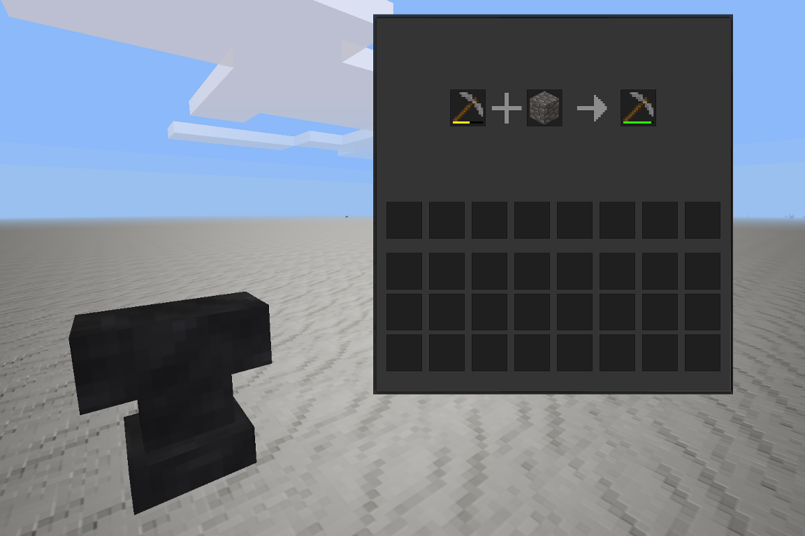

# Anvil for [Minetest](http://minetest.net/)
Simple anvil mod for repairing tools (pickaxes, swords, axes and shovels).

Two ways to repair:
1. Tool + crafting component (tool has to be damaged)
2. Tool + Tool (at least one has to be damaged)

Currently supports single component repair only.

## Credits
`anvil_smith.ogg` - by Stephan Schutze from [http://SoundBible.com]
